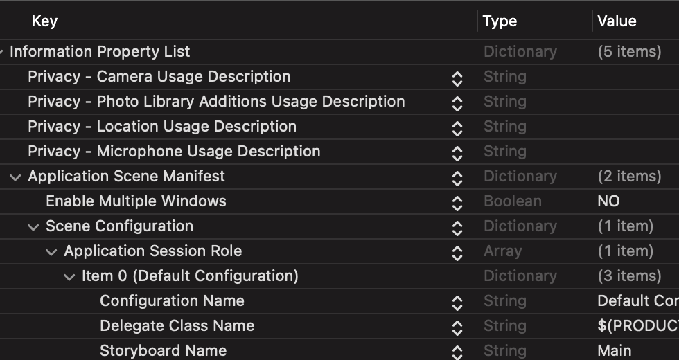

#  camera & photo

MobileCoreService 에는 ios에서 사용할 모든 데이타들이 정의되어 있음


'kUTTypeImage' was deprecated in iOS 15.0: Use UTTypeImage instead.

```
            imagePicker.mediaTypes = [kUTTypeMovie as String]
            imagePicker.mediaTypes = [UTType.movie.identifier]
               
            let mediaType = info[UIImagePickerControllerMediaType] as!  NSString
            let mediaType = info[UIImagePickerController.InfoKey.mediaType] as! NSString
            
            
            Replace 'UIImagePickerControllerOriginalImage' with
                    'UIImagePickerController.InfoKey.originalImage'
```


